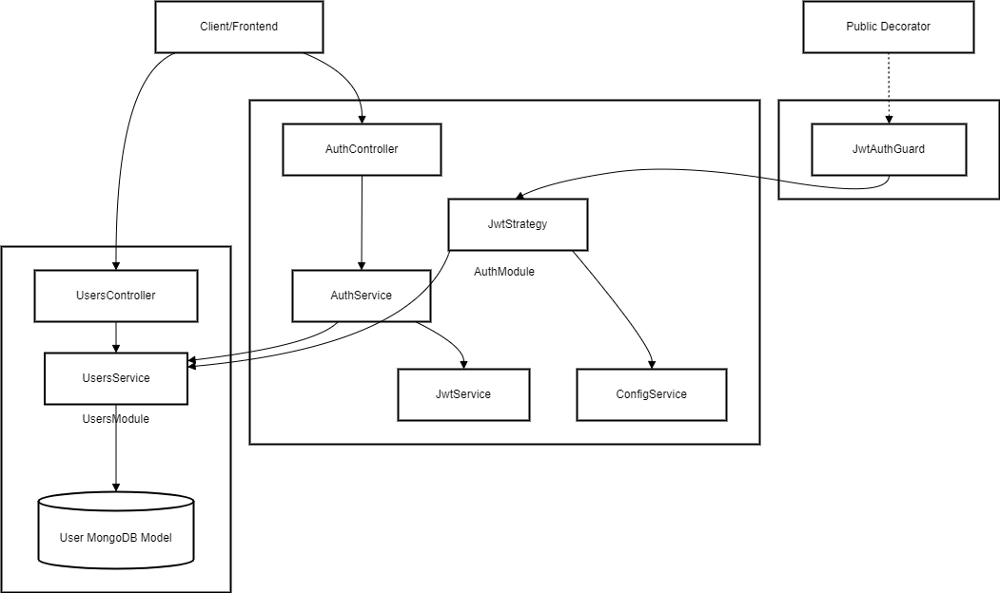

# Backend Authentication Service

This project is a backend authentication service built using the [NestJS](https://nestjs.com/) framework. It provides a robust and scalable solution for user authentication and management, including features like signup, login, token refresh, and logout.

---

## Features

### Authentication
- **Signup**: Register new users with email, name, and password.
- **Login**: Authenticate users and issue access and refresh tokens.
- **Token Refresh**: Refresh access tokens using refresh tokens.
- **Logout**: Invalidate refresh tokens upon logout.

### Security
- **JWT Authentication**: Secure endpoints using JSON Web Tokens (JWT).
- **Password Hashing**: User passwords are hashed using bcrypt for secure storage.
- **Validation**: Input validation using `class-validator` and `class-transformer`.

### API Documentation
- **Swagger**: Comprehensive API documentation available at `/api/docs`.

### Logging
- **Custom Logger**: Logs HTTP requests and application events using Winston.
- **Log Files**: Separate logs for errors and combined logs.

### Database
- **MongoDB**: Integrated with MongoDB using Mongoose for user data storage.

### Testing
- **Unit Tests**: Test individual components.
- **End-to-End Tests**: Test the entire application flow.

---

## Installation

### Prerequisites
- Node.js (v16 or higher)
- MongoDB instance
- npm (v8 or higher)

### Steps
1. Install dependencies:
   ```bash
   npm install
   ```

2. Create a `.env` file in the root directory with the following variables (Must exist):
   ```env
   MONGODB_URI=mongodb://localhost:27017/auth-app
   JWT_SECRET=jwt_secret_key
   ACCESS_TOKEN_SECRET=access_token_secret_key
   REFRESH_TOKEN_SECRET=refresh_token_secret_key
   ACCESS_TOKEN_EXPIRES_IN=1d
   REFRESH_TOKEN_EXPIRES_IN=7d

   JWT_EXPIRES_IN=1d
   NODE_ENV=development
   ```

---

## Running the Application

### Development
```bash
npm run start
```

### Watch Mode
```bash
npm run start:dev
```

### Production
```bash
npm run start:prod
```

---

## API Endpoints

### Authentication
- **POST** `/auth/signup`: Register a new user.
- **POST** `/auth/signin`: Login and get access/refresh tokens.
- **POST** `/auth/refresh`: Refresh the access token.
- **POST** `/auth/logout`: Logout and invalidate the refresh token.

### Users
- **GET** `/users/profile`: Fetch the current user's profile (protected endpoint).

---

## Diagram



---

## Testing

### Unit Tests
```bash
npm run test
```

---

## Implementation Details

### Folder Structure
```
backend-auth/
├── src/
│   ├── auth/               # Authentication module
│   ├── users/              # User module
│   ├── logger/             # Custom logger module
│   ├── common/             # Shared utilities and decorators
│   ├── app.module.ts       # Root module
│   ├── main.ts             # Application entry point
├── test/                   # End-to-end tests
├── .env                    # Environment variables
├── package.json            # Project dependencies and scripts
├── README.md               # Project documentation
```

### Key Modules
1. **Auth Module**:
   - Handles user authentication (signup, login, token refresh, logout).
   - Implements JWT strategy for securing endpoints.

2. **Users Module**:
   - Manages user data and profiles.
   - Provides methods for creating and retrieving users.

3. **Logger Module**:
   - Custom logging using Winston.
   - Logs HTTP requests and application events.

4. **Common Module**:
   - Contains shared utilities like custom decorators (`@Public`, `@GetUser`).

### Middleware
- **Logger Middleware**: Logs HTTP requests with method, URL, status code, and response time.

### Validation
- **Global Validation Pipe**: Ensures all incoming requests are validated against DTOs.

### Swagger
- **Setup**: Swagger documentation is available at `/api/docs`.
- **Configuration**: Defined in `src/main.ts` using `@nestjs/swagger`.

---

## Deployment

### Build
```bash
npm run build
```

### Start Production Server
```bash
npm run start:prod
```
